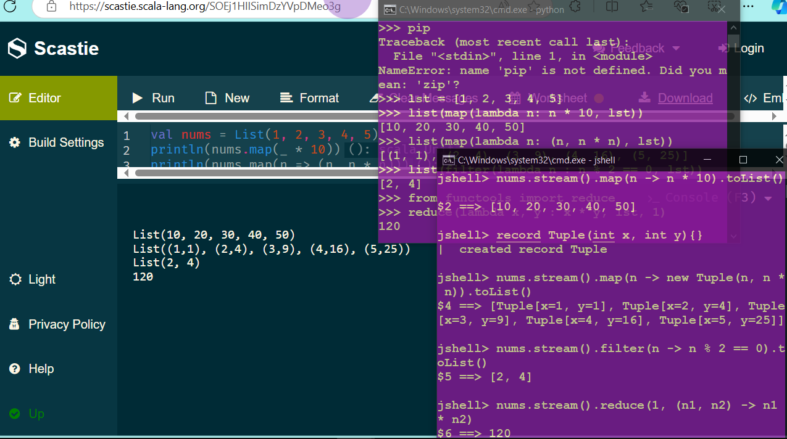
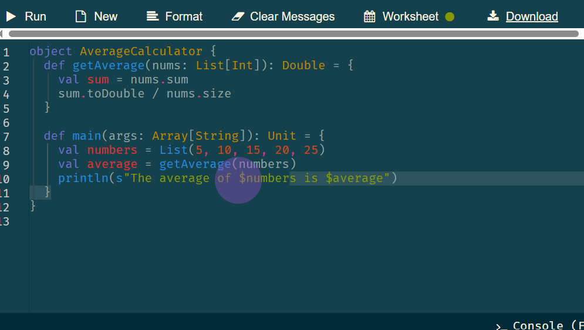
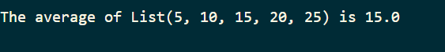
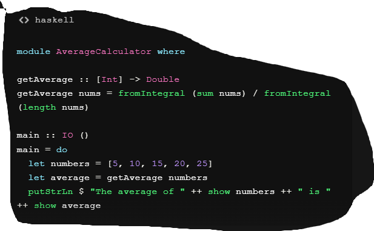
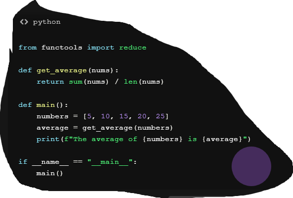

# Por MRodz Oficial 😉
# Taller Individual Nro. 1
## Primeros pasos en programación funcional

**Semana**: 1

**Objetivos**:

- Conocer las herramientas que utilizará en la asignatura: Gitpod, SDKMAN, Scala-CLI
- Familiarizarse con cada de las herramientas, especialmente el entorno Gitpod.
- Crear su primer programa funcional.

### Descripción:

#### Primera parte:

Usar Gitpod para instalar algunas herramientas adicionales, tales como Java 21, SBT (Scala Building Tool) y Scala-CLI.

Para el proceso de instalación utilizará la herramienta denominada SDKMan que ya se encuentra instalada en nuestro entorno Gitpod. Lo primero que debe hacer es utilizar el terminal para ejecutar el siguiente comando:

```shell
sdk list java
```

Navegar por la tabla resultante hasta que en la columna Vendor aparezca el texto *Java.net*, en la columna Version buscar la opción *23*, seleccionar y copiar el texto de la columna *Identifier*. Para salir de la tabla presione la tecla **q**

Con el texto copiado ejecutar el comando:

```shell
sdk install java texto_copiado_columna_identifier
```

De manera similar navegar e instalar las últimas versiones de las herramientas sbt y Scala CLI. Los identificadores que usar SDK son *sbt* y *scalacli* respectivamente. Aquí las tablas son más sencillas ya que no existen diferentes proveedores y únicamente se mostrará la lista de versiones. No olvide usar la letra q para salir de las listas.

Una vez que concluya con todas las instalaciones deberá llamar a su docente para verificar la correcta instalación de las mismas.

#Parte 1 - Trabajo:


#### Segunda parte:

Son muchos los lenguajes de programación que actualmente soportan el paradigma de programación funcional, muchos de ellos, no son 100% funcionales, pero, implementan los conceptos principales. Entre los lenguajes que se usará en esta asignatura se encuentran:

- Scala 3
- Java 23
- Python 3

El orden del listado anterior muestra la frecuencia de uso de cada lenguaje. Scala se usará en la parte docente, para explicar los conceptos de la programación funcional. Java y Python serán utilizados en la parte práctica. Recuerde, la idea principal de la asignatura es que usted aprenda acerca de programación funcional y no convertirlo en experto en un lenguaje de programación.


Es momento de pasar a la práctica. Realice las siguientes actividades:

- Abrir tres ventanas del terminal
- Ejecutar las herramientas REPL de los lenguajes de programación Java, Scala y Python, para consegir esto debe ejecutar:
	- En la primera ventana ejecutará el comando: *jshell*
	- En la segunda ejecutar: *scala*
	- En la tercera ejecutará *ipython*

En cada una de las ventanas ejecutará los siguientes comandos:

Para Java (jshell)

```java
var nums = List.of(1, 2, 3, 4, 5);
nums.stream().map(n -> n * 10).toList();
record Tuple(int x, int y){};
nums.stream().map(n -> new Tuple(n, n * n)).toList();
nums.stream().filter(n -> n % 2 == 0).toList();
nums.stream().reduce(1, (n1, n2) -> n1 * n2);
```

En Scala (scala)

```scala
val nums = List(1, 2, 3, 4, 5)
nums.map(_ * 10)                                                                              
nums.map(n => (n, n * n))
nums.filter(n => n % 2 == 0)
nums.reduce((n1, n2) => n1 * n2)
```


En Python

```python
lst = [1, 2, 3, 4, 5]
list(map(lambda n: n * 10, lst))
list(map(lambda n: (n, n * n), lst))
list(filter(lambda n : n % 2 == 0, lst))
from functools import reduce
reduce(lambda x, y : x * y, lst, 1)
```

Las sentencias anteriores en cualquier lenguaje hacen lo siguiente:

1. Declarar e inicializar una lista de números enteros
2. *Mapear* crear una nueva lista en donde cada elemento es fruto de la multiplicación por 10 de los elementos de lista anterior.
3. *Mapear* crear una nueva lista en donde cada elemento es una *tupla* que se genera con el elemento de la lista original y su cuadrado.
4. Filtrar los números que son pares
5. *Reducir* calcular el producto de los elementos que se encuentran en la lista.

Note como en cada uno de los lenguajes utilizan formas diferentes para trabajar con expresiones o también conocidos como funciones lambda, así: Java usa ->, Scala emplea => y Python la palabra lambda. Observe también como Scala y Python tienen un estructura de datos denominada tupla, mientras que en Java se debe utilizar un tipo de clase denominado record.

Luego de revisar los programas ¿cuál de ellos tiene una sintaxis más fácil de comprender?

Antes de finalizar con la actividad planificada, es momento de proponer un ejercicio que tiene dos partes.

La primera, transformar el siguiente código Java a Scala (use el texto de [Scala 3, una breve iniciación](https://github.com/jorgaf/scala-3-intro/wiki/Scala-3,-una-breve-iniciación))

```java
double getAverage(List<Integer> nums) {
	var sum = 0;
	for(var num : nums) {
		sum += num;
	}
	return sum / (double)nums.size();
}
```

La segunda, pídale al ChatGPT que transforme el código anterior, escrito de forma imperativa, a una versión en donde se utilice el paradigma de programación funcional, para los lenguajes de programación: Haskel, Python y Scala 3. Le sugiero incluir en el prompt el código Java anterior. Implemente el código que obtuvo utilizando la herramienta **Scala CLI**. A través del comando:

// Parte 2:

// Scala: 



// Haskell: 


// Python:




```shell
scala-cli repl
```

Esta segunda parte finaliza cuando muestre a su docente todo lo implementado.


### Calificación:

Cosiderando que este taller es especial, la calificación se hará en la semana 2.
