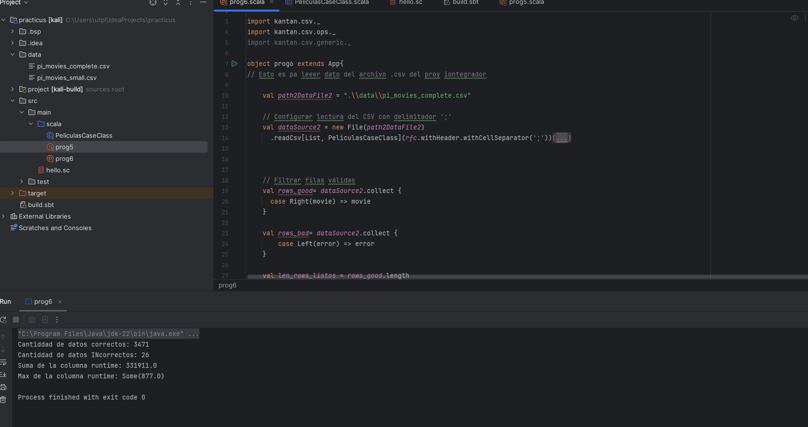
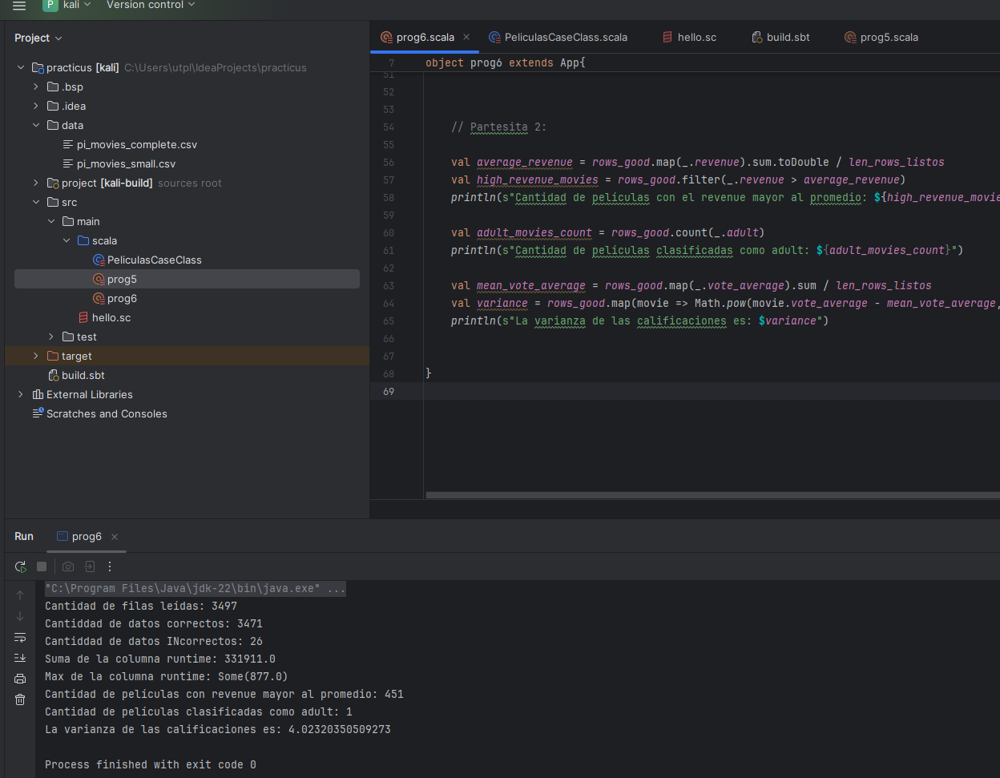

# Taller Grupal  1
## Programación funcional reactiva

**Semana**: 11

**Objetivos**:

- Crear un case class en Scala para modelar datos de un archivo CSV (data set de proyecto integrador).
- Manipular datos como una lista de objetos y realizar operaciones estadísticas.
- Comprender la relación entre datos y aplicar fórmulas estadísticas a análisis exploratorios.

> [!IMPORTANT]
> Resolver el siguiente problema en grupos según proyecto integrador (**solo estudiantes presentes en el aula**)

***


### Parte 1: Definición de case class y lectura de archivo

- Utilizando la case clase que construyó, como tarea, lea los datos del dataset de movies y trate de responder a las siguientes preguntas:

  Asegúrese que los atributos `popularity`, `runtime`, `vote_average` son de tipo real.

  - ¿Cuántas filas pudo leer? ->  3497
  ```scala 
  println(s"Cantidad de filas leídas: ${len_rows_listos + len_rows_malos}")
  ```

  - ¿Cuántos filas son `Right`? -> 3471
  ```scala 
    println(s"Cantidad de filas Right: ${len_rows_listos}")
    ```
  - ¿Cuántos filas son `Left`? -> 26
  ```scala 
  println(s"Cantidad de filas Left: ${len_rows_malos}")
  ```

- Ahora modifique el case class para que el atributo runtime sea del tipo
`Option[Double]` y vuelva a responder las preguntas anteriores.


> Adjuntar código y capturas de ejecución
Codigo:
``` scala
import java.io.File

import kantan.csv._
import kantan.csv.ops._
import kantan.csv.generic._

object prog6 extends App{
// Esto es pa leeer dato del archivo .csv del proy iontegrador

    val path2DataFile2 = ".\\data\\pi_movies_complete.csv"

    // Configurar lectura del CSV con delimitador ';'
    val dataSource2 = new File(path2DataFile2)
      .readCsv[List, PeliculasCaseClass](rfc.withHeader.withCellSeparator(';'))


    // Filtrar filas válidas
    val rows_good= dataSource2.collect {
      case Right(movie) => movie
    }

    val rows_bad= dataSource2.collect {
        case Left(error) => error
    }

    val len_rows_listos = rows_good.length
    val len_rows_malos = rows_bad.length


    println(s"Cantiddad de datos correctos: ${len_rows_listos}")
    println(s"Cantiddad de datos INcorrectos: ${len_rows_malos}")

    // val sum_runtime = rows_good.map(_.runtime).sum // aqui estamos seleccionando la columna "runtime" y sumando todos sus valores
    //println(s"suma de la columna runtime: ${sum_runtime}")

// NOTA : IMPORTATINSIEMA. mMODIFICAMOS ESTA SECCION POR QUE DEBEMOS DE MANEJAR EL TIPO OPTION Y CONVERTIRLO A DOUBLE

    // PRESERVAR ESTO:
    // 0 como valor por defecto si es None
    val sum_runtime = rows_good.map(_.runtime.getOrElse(0.0)).sum
    println(s"Suma de la columna runtime: ${sum_runtime}")

    val max_runtime = rows_good.map(_.runtime).max.get

    println(s"Max de la columna runtime: ${max_runtime}")

    // ahyora maejemos los casos en donde hay datos sucios, es decir el tipo de atributo de una columna, no es el esperado por el patter-matching de nuestro lector de .csv
    //
    // para esto, vamos a nuestra case class, y a cambiar el tipo de dato de "runtime:. De un INT, a un opcion
}

```

Capturas:


### Parte 2: Análisis de datos

- Filtra aquellas películas cuyo `revenue` sea mayor al promedio de los ingresos del conjunto de datos.
- Cuenta cuántas películas tienen el atributo `adult` configurado como `true`.
- Calcula la varianza de las calificaciones (`vote_average`) usando la fórmula

  $$
  \sigma^2 = \frac{\sum_{i=1}^{n} (x_i - \overline{x})^2}{n}
  $$

  Donde $x_i$ es el **vote_average** de cada película, $\overline{x}$ es el promedio de las **vote_average** y $n$ es el número total de películas.

> Adjuntar los bloques de código y capturas de ejecución

Codigo:
``` scala
    val average_revenue = rows_good.map(_.revenue).sum.toDouble / len_rows_listos
    val high_revenue_movies = rows_good.filter(_.revenue > average_revenue)
    println(s"Cantidad de películas con el revenue mayor al promedio: ${high_revenue_movies.length}")

    val adult_movies_count = rows_good.count(_.adult)
    println(s"Cantidad de películas clasificadas como adult: ${adult_movies_count}")

    val mean_vote_average = rows_good.map(_.vote_average).sum / len_rows_listos
    val variance = rows_good.map(movie => Math.pow(movie.vote_average - mean_vote_average, 2)).sum / len_rows_listos
    println(s"La varianza de las calificaciones es: $variance")
```
Captura:


### Calificación:

Una vez que termine debe presentar su trabajo a su docente.

- 10 puntos si presenta en el horario de prácticas y experimentación.
- 7 puntos si presenta en el horario de tutoría

La hora máxima de presentación será las 16h30
